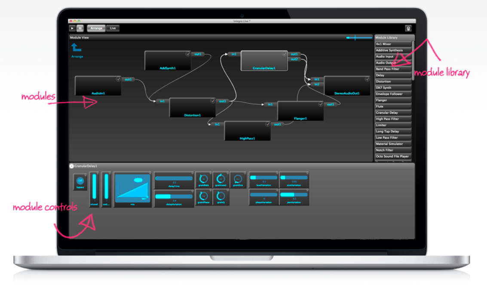
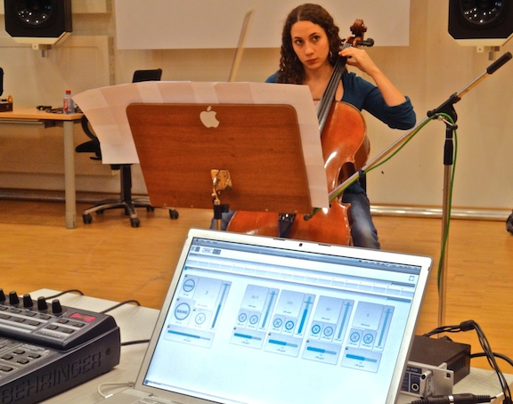

# Introducing live electronic music with Integra Live

Duration: 2 hours  

Tutors:  Dr. Jamie Bullock, Prof. Lamberto Coccioli  

Target audience: Composers, performers and teachers of live electronic music  
Keywords: live electronics, interaction, music, technology  

## Description

In this workshop we will share with participants the techniques and practice of live electronic music using the Integra Live software ([integralive.org](http://integralive.org)). We will introduce the software through a practical “hands on” demo and present a range of live electronic techniques including audio processing and analysis, on screen and tactile control, and automation. We will also describe the activities of the Integra Lab and the Music Technology department at Birmingham Conservatoire and discuss possibilities for future collaboration.

Workshop attendees are invited to bring musical instruments, laptops or work in progress to try with the software.

## About Integra Lab

Integra Lab ([http://integra.io/lab](http://integra.io/lab)) is an interdisciplinary research lab, with a focus on musician-computer interaction. Our goal is to create new technologies that empower, inspire and delight musicians. Integra Lab provides a unique opportunity for researchers in interactive music technology, user-centred design and digital signal processing to enhance musical experience through direct collaboration with performers and composers. 

Integra Lab was founded in 2009 to support the €3.1M EU-funded Integra project. Bringing together new music ensembles, research centres and higher music education institutions from eight European countries and Canada, Integra promoted the wider dissemination of live electronic music and provided composers, performers, teachers and students with the tools to interact with technology in a more user-friendly and musically meaningful way. 

## Biographies

**Jamie Bullock** is senior researcher in music technology at Birmingham Conservatoire. He led the development of Integra Live, an interactive environment for modular audio processing with over 15,000 downloads, and used in teaching institutions worldwide. He is also the author of [LibXtract](https://github.com/jamiebullock/LibXtract), a library for audio feature extraction widely deployed in analysis applications such as Sonic Visualiser.  

Website: [http://jamiebullock.com](http://jamiebullock.com)  
Twitter: [@jamiebullock](http://twitter.com/jamiebullock)

**Lamberto Coccioli** is Head of Music Technology at Birmingham Conservatoire. He has more than 20 years of international experience as a composer, performer and researcher in music with live electronics, including working five years with Luciano Berio at Centro Tempo Reale and collaborating with Jonathan Harvey, Luca Francesconi, Julian Anderson and Kaija Saariaho among many others. From 2005 to 2012 Lamberto managed _Integra – Fusing music and technology_, a large EU-funded project to promote and disseminate live electronic music in Europe.

Website: [http://www.lambertococcioli.com](http://www.lambertococcioli.com)

